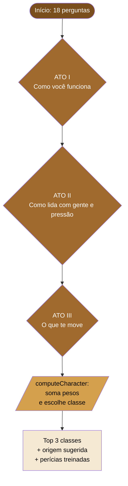
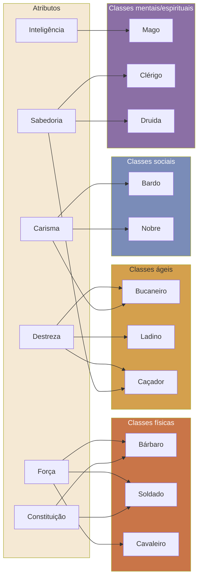
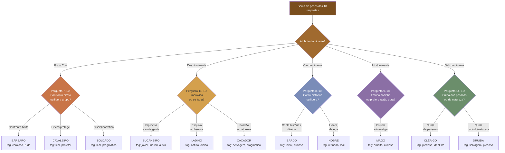

# Forja de Ghanor

Mini-aplicativo web para criar personagens de 1º nível de **A Lenda de Ghanor RPG**. É uma ferramenta auxiliar feita por fãs, com wizard de criação, cálculo de atributos derivados, ficha imprimível, Supabase Auth/Database/Storage e retrato por IA.

## Stack

- Next.js App Router + TypeScript
- Tailwind CSS
- Supabase Auth, Postgres e Storage
- Zod, React Hook Form e Zustand
- OpenAI Images API
- Vitest

## Configuração

Crie `.env.local` com:

```env
NEXT_PUBLIC_SUPABASE_URL=https://goijhxeefrecehuqobrn.supabase.co
NEXT_PUBLIC_SUPABASE_PUBLISHABLE_KEY=sb_publishable_xxx
SUPABASE_SERVICE_ROLE_KEY=
OPENAI_API_KEY=
```

`NEXT_PUBLIC_SUPABASE_PUBLISHABLE_KEY` pode ficar no client. `SUPABASE_SERVICE_ROLE_KEY` e `OPENAI_API_KEY` devem existir apenas no ambiente server/Vercel. Se uma chave secreta foi compartilhada em chat, rotacione no painel do Supabase antes de usar.

## Banco de dados

O schema está em [`lib/supabase/schema.sql`](./lib/supabase/schema.sql).

Aplicar pelo SQL Editor:

1. Abra o projeto no Supabase.
2. Vá em **SQL Editor**.
3. Cole o conteúdo de `lib/supabase/schema.sql`.
4. Execute.

Aplicar pela CLI:

```bash
supabase login
supabase link --project-ref goijhxeefrecehuqobrn
supabase db push
```

O schema cria a tabela `characters`, políticas RLS por `auth.uid()`, trigger de `updated_at` e bucket `character-portraits`.

## Desenvolvimento

```bash
npm run dev
npm run lint
npm run test
npm run build
```

Abra `http://localhost:3000`.

## Deploy na Vercel

Configure as variáveis:

- `NEXT_PUBLIC_SUPABASE_URL`
- `NEXT_PUBLIC_SUPABASE_PUBLISHABLE_KEY`
- `SUPABASE_SERVICE_ROLE_KEY`
- `OPENAI_API_KEY`

No Supabase Auth, adicione as URLs de callback:

- `http://localhost:3000/auth/callback`
- `https://SEU-PROJETO.vercel.app/auth/callback`

O cadastro usa nome de usuario + senha. Internamente o app cria um email tecnico
`usuario@users.minialendadeghanor.app` ja confirmado via `SUPABASE_SERVICE_ROLE_KEY`, e salva
o email real informado em `user_metadata.recovery_email` para recuperacao futura.

---

## Quiz Guiado — Documentação

A rota `/characters/new/guided` oferece um quiz de 18 perguntas que sugere automaticamente uma classe, atributos e perícias com base no perfil do jogador.

As perguntas são divididas em **3 atos** com temática contemporânea ("Que tipo de pessoa você é?"). Cada resposta acumula pontos em atributos, classes e tags. No final, `computeCharacter` em `lib/ghanor/quiz-engine.ts` converte esses pontos numa ficha completa.

O conteúdo das perguntas fica em `lib/ghanor/quiz.ts`. A engine de conversão (que **não deve ser alterada**) fica em `lib/ghanor/quiz-engine.ts`.

### Visão geral — Como as perguntas levam às classes



### Mapa de pesos — Quais atributos puxam quais classes



### Árvore decisória aproximada



### Tabela auxiliar — Resumo de cada pergunta → classes principais

| # | Tema da pergunta | Opções e classes principais que cada uma puxa |
|---|---|---|
| 1 | Manhã ideal | A: Soldado/Cavaleiro · B: Bucaneiro · C: Druida/Mago · D: Nobre/Mago |
| 2 | Última vez fora de si | A: Bárbaro · B: Druida/Clérigo · C: Bardo/Ladino · D: Nobre |
| 3 | Noite de domingo | A: Mago · B: Bardo/Nobre · C: Soldado · D: Bucaneiro |
| 4 | Objeto guardado | A: Cavaleiro/Clérigo · B: Ladino/Bardo · C: Mago/Caçador · D: Druida/Caçador |
| 5 | Pessoa que influenciou | A: Soldado/Cavaleiro · B: Mago · C: Bardo · D: Cavaleiro/Clérigo |
| 6 | Por que mudou de vida | A: Bárbaro/Cavaleiro · B: Bardo/Bucaneiro · C: Clérigo/Druida · D: Ladino |
| 7 | Briga em grupo WhatsApp | A: Cavaleiro · B: Bardo · C: Druida/Ladino · D: Clérigo/Nobre |
| 8 | Festa com desconhecidos | A: Bardo/Nobre · B: Clérigo · C: Ladino/Mago · D: Bárbaro/Soldado |
| 9 | Como aprende algo novo | A: Mago · B: Bucaneiro/Soldado · C: Nobre · D: Mago/Cavaleiro |
| 10 | Convencer alguém | A: Bárbaro/Soldado · B: Bardo · C: Cavaleiro/Clérigo · D: Ladino/Bucaneiro |
| 11 | Prazo apertado | A: Soldado · B: Bárbaro/Soldado · C: Nobre · D: Bucaneiro/Bardo |
| 12 | Alguém te magoou | A: Cavaleiro · B: Nobre/Ladino · C: Ladino · D: Clérigo |
| 13 | Folga inesperada | A: Bárbaro/Soldado · B: Mago · C: Druida/Caçador · D: Bardo/Bucaneiro |
| 14 | O que te dá raiva | A: Cavaleiro · B: Ladino/Bardo · C: Mago · D: Druida |
| 15 | Cabeça, coração ou mão | A: Mago · B: Clérigo · C: Soldado/Cavaleiro · D: Bardo/Nobre |
| 16 | Vê algo errado, não é seu | A: Cavaleiro/Nobre · B: Ladino · C: Clérigo/Druida · D: Ladino/Caçador |
| 17 | Como quer ser lembrado | A: Cavaleiro/Soldado · B: Mago · C: Bardo · D: Nobre |
| 18 | Super poder pequeno | A: Bárbaro/Soldado · B: Mago · C: Clérigo/Nobre · D: Ladino |

---

## Aviso

Ferramenta criada por fãs. A Lenda de Ghanor é marca registrada da Jambô Editora. Este projeto não é afiliado nem endossado por Jovem Nerd ou Jambô.
